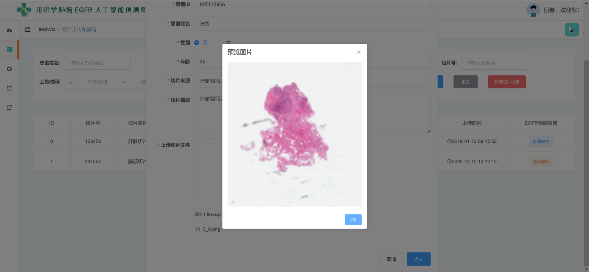
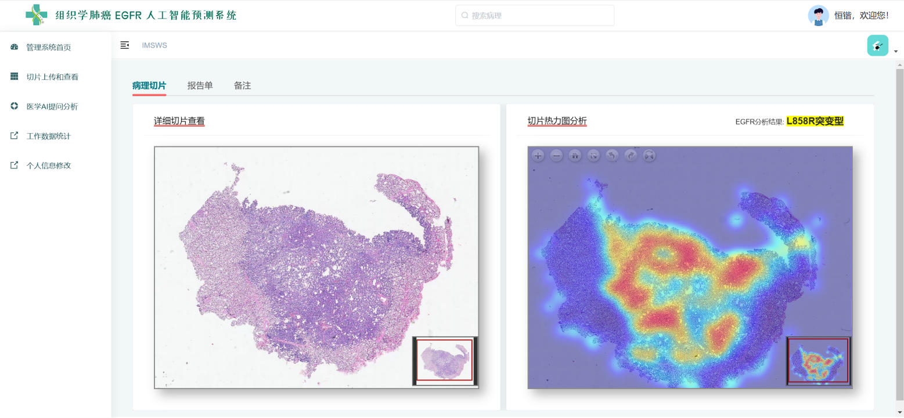
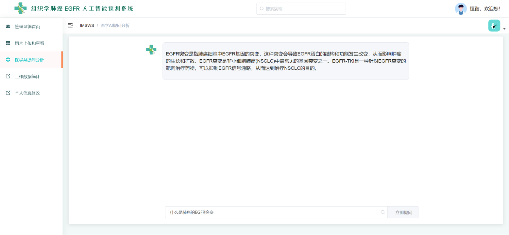
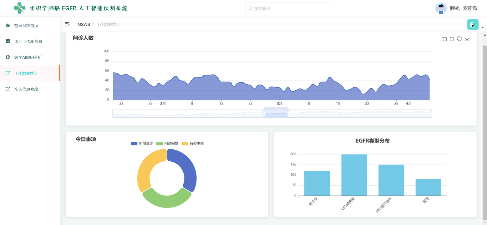
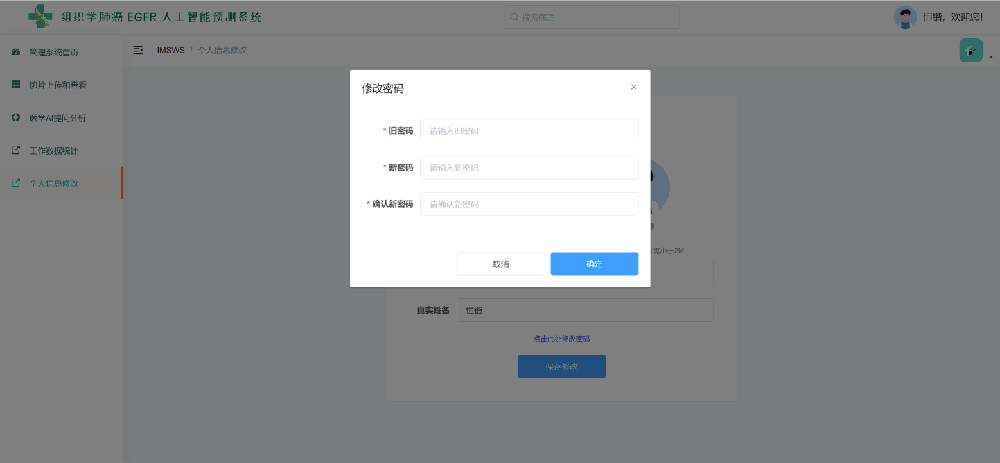

**Language / 语言**: [English](README.md) | [中文](README.zh.md)

# Histological Lung Cancer EGFR AI Prediction System  

---

### Workflow  

[1] Launch the "Histological Lung Cancer EGFR AI Prediction System" and enter the user login interface. Enter your username and password, then click the **Login** button. If you do not have an account, click **Register** to create one.  

  

[2] On the registration page, fill in a username, password, and confirm password, then click **Register**. After successful registration, return to the login page.  

  

[3] After logging in, the main interface displays welcome information, shortcut entries for system modules, and an overview of pending tasks, new consultations, and responses. Quick navigation links allow access to modules such as **Slide Upload & Viewing**, **AI Analysis Q&A**, and **Data Statistics**.  

  

[4] In the **Slide Upload & Viewing** module, users can search existing slides by patient name, source, or ID, and either view or upload new slides.  

  

[5] By clicking **New Slide**, users can upload new slides. Fill in patient ID, name, gender, age, source, and description, then upload SVS/PNG/JPG files and click **Submit**.  

  

[6] After uploading, users can preview the slide image by clicking **Preview** to confirm upload success.  

  

[7] In the **Slide Analysis** page, the uploaded slide and EGFR mutation results are shown. Results are displayed as a heatmap, highlighting predicted mutation types (e.g., L858R).  

  

[8] Users can also view a full **Analysis Report**, which includes patient details, slide description, analysis results, and expert recommendations. Reports can be downloaded or printed.  

  

[9] In the **AI Analysis Q&A** module, users can ask EGFR-related questions. The system responds based on existing analysis data and knowledge base.  

  

[10] Example: asking *“What is the most common EGFR mutation?”* will return relevant explanations and clinical insights.  

  

[11] In the **Data Statistics** module, line charts show consultation trends, pie charts display today's tasks (consultations, replies, pending items), and bar charts show EGFR mutation distributions.  

  

[12] In **Profile Settings**, users can update personal information (e.g., avatar, username, real name).  

  

[13] Passwords can be changed in the same interface by entering the old and new password, then confirming the update.  

  

