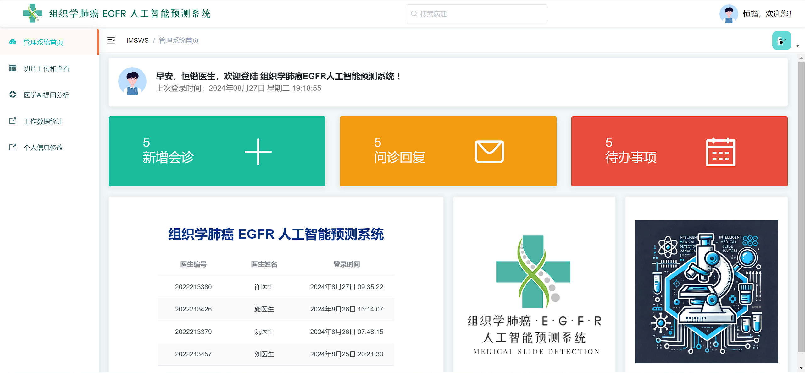
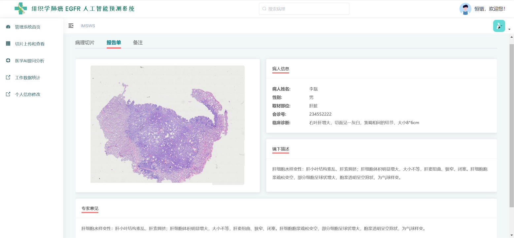

**Language / 语言**: [English](README.md) | [中文](README.zh.md)

# 组织学肺癌 EGFR 人工智能预测系统 

---

### 流程操作  

[1] 启动“组织学肺癌EGFR人工智能预测系统”，进入用户登录界面。输入用户名和密码后点击**登录**。如果没有账号，可以点击**注册**创建新账户。  

  

[2] 在注册页面，填写用户名、密码和确认密码，然后点击**注册**。注册成功后返回登录界面进行登录。  

  

[3] 登录成功后，进入系统主界面。界面显示欢迎信息、模块快捷入口、待处理任务、新增会诊及问诊回复等信息，并提供快速导航进入**切片上传与查看**、**医学AI提问分析**、**工作数据统计**等模块。  

  

[4] 在**切片上传与查看**模块，用户可通过患者姓名、切片来源或编号筛选并查看切片，也可上传新切片。  

  

[5] 点击**新建切片**按钮后，用户可上传新切片。填写患者ID、姓名、性别、年龄、切片来源和描述，上传SVS/PNG/JPG文件，最后点击**提交**。  

  

[6] 上传完成后，可通过点击**预览**按钮查看切片图像，确认是否上传成功。  

  

[7] 在**切片分析**页面，系统展示原始切片图像和EGFR突变分析结果。结果以热力图形式呈现，标注预测突变类型（如L858R）。  

  

[8] 用户可在**分析报告**中查看完整结果，包括患者信息、切片描述、分析结果和专家建议，并可下载或打印报告。  

  

[9] 在**医学AI提问分析**模块，用户可以提出与EGFR突变相关的问题，系统基于已有数据和知识库返回回答。  

  

[10] 示例：用户输入“什么是肺癌的EGFR突变”，系统将返回解释和临床意义。  

  

[11] 在**工作数据统计**模块，折线图展示问诊趋势，饼图展示今日事项（新增会诊、回复、待办），柱状图展示不同EGFR突变类型的分布。  

  

[12] 在**个人信息修改**界面，用户可更换头像，修改用户名和真实姓名。  

  

[13] 用户可通过**修改密码**功能更改账户密码，输入旧密码与新密码后确认即可完成修改。  

  

---